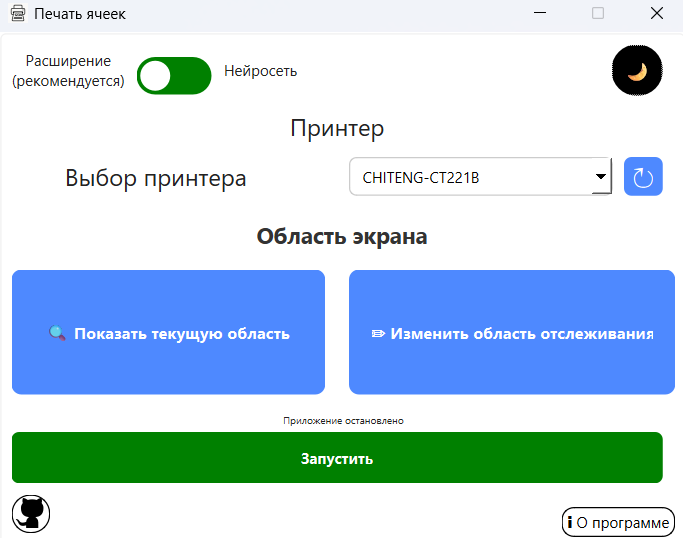
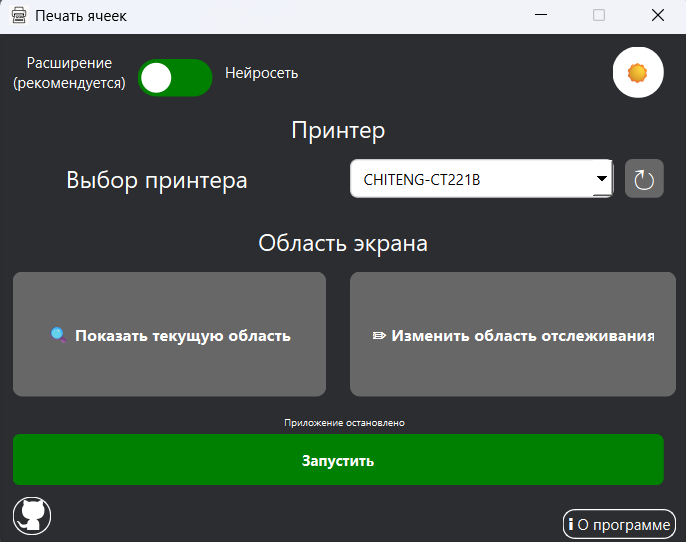

# Печать ячеек

**Печать ячеек** — небольшое приложение для Windows, которое отслеживает номер в заданной области экрана и автоматически отправляет его на печать. Вместе с программой поставляется браузерное расширение `expansion/send_number_goods`, позволяющее передавать номера напрямую на локальный принт‑сервер.

## Внешний вид

Приложение поддерживает светлую и тёмную темы. Ниже приведены примеры интерфейса в обеих темах:

| Светлая тема | Тёмная тема |
|--------------|-------------|
|||

## Требования

- Python 3.10+
- Windows с настроенным принтером (используется API `win32ui`)

Необходимые зависимости перечислены в `requirements.txt` и устанавливаются командой:

```bash
pip install -r requirements.txt
```

## Запуск

Для старта интерфейса выполните:

```bash
python main.py
```

При первом запуске выберите подходящий режим работы:

### Режим расширения (рекомендуется)
1. Откройте `chrome://extensions` в браузере на базе Chromium.
2. Включите режим разработчика и нажмите «Загрузить распакованное расширение».
3. Укажите путь к каталогу `expansion/send_number_goods` из данного проекта.
4. После установки расширения обновите вкладку сайта Ozon, если она была открыта заранее.
5. Запустите приложение.

### Режим нейросети
1. Укажите принтер для печати.
2. Выберите область экрана, которую необходимо отслеживать.
3. Запустите приложение.

### Общие шаги
- Выберите принтер и убедитесь, что он корректно настроен через панель управления Windows.
- Нажмите «Запустить» в окне программы. При работе приложение показывает статус в верхней части окна.

## Сборка exe

Для получения переносимого exe‑файла используйте скрипт `build_exe.py`:

```bash
python build_exe.py
```

В результате в корне проекта появится файл `OzonControl.exe`, который можно запускать на любой машине без установки Python.

## Структура проекта

- `UI/` — код интерфейса и сгенерированные формы Qt
- `ScreenToPrint/` — захват экрана и печать текста
- `expansion/` — расширение для сайта Ozon
- `local_print_server/` — локальный сервер печати
- `Tesseract-OCR/` — бинарные файлы и данные Tesseract

## Примечания

Приложение ориентировано на Windows и использует Win32 API. Работа на других платформах не гарантируется.
